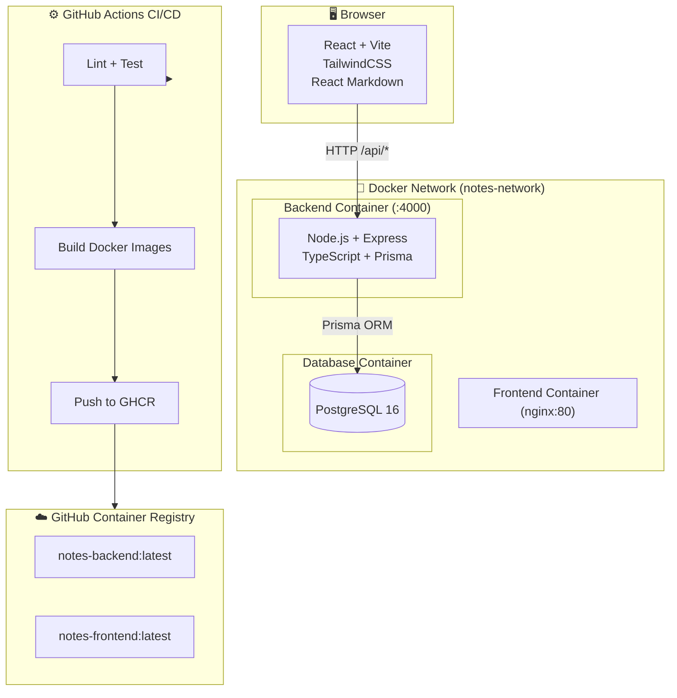

# 📝 Markdown Notes App

[](https://github.com/YoussefElaatiki/Exam_Devops/actions/workflows/ci-cd.yml)
[](https://opensource.org/licenses/MIT)

> A production-grade full-stack web application for creating, editing, and sharing notes with real-time Markdown preview. Built with Node.js, React, PostgreSQL and deployed via Docker Compose.

## 🚀 Quick Start (One Command)

```bash
cd 04-notes-app
cp .env.example .env
docker compose up --build
```

- **Frontend**: http://localhost:3000
- **Backend API**: http://localhost:4000
- **Demo login**: `user@notes.app` / `user123`

---

## 📐 Architecture



---

## 🗂️ Project Structure

```text
04-notes-app/
├── backend/            # Node.js + Express + TypeScript API
│   ├── src/
│   │   ├── routes/     # auth.ts, notes.ts
│   │   ├── middleware/ # auth.ts, errorHandler.ts
│   │   ├── schemas/    # Zod validation schemas
│   │   └── tests/      # Vitest + Supertest tests
│   └── prisma/         # Schema + seed script
├── frontend/           # React + Vite + TailwindCSS
│   └── src/
│       ├── pages/      # Login, Register, Dashboard, NoteDetail, PublicNote
│       ├── components/ # NoteCard, NoteEditor, MarkdownPreview, SearchBar
│       ├── hooks/      # useNotes
│       └── store/      # Zustand auth store
├── k8s/                # Kubernetes manifests (bonus)
├── docker-compose.yml
└── .env.example
```

---

## ✨ Features

| Feature | Status |
|---|---|
| Create, edit, delete notes | ✅ |
| Real-time Markdown preview (split view) | ✅ |
| Tags support | ✅ |
| Full-text search | ✅ |
| Share via public link | ✅ |
| JWT Authentication (register/login) | ✅ |
| Role-based access (USER / ADMIN) | ✅ |
| Responsive UI | ✅ |
| PostgreSQL persistence | ✅ |

---

## 🔌 API Routes

### Authentication
| Method | Endpoint | Auth | Description |
|--------|----------|------|-------------|
| POST | `/api/auth/register` | ❌ | Register new user |
| POST | `/api/auth/login` | ❌ | Login + get JWT token |
| GET | `/api/auth/me` | ✅ | Get current user |

### Notes
| Method | Endpoint | Auth | Description |
|--------|----------|------|-------------|
| GET | `/api/notes` | ✅ | List all notes (supports `?search=` and `?tags=`) |
| POST | `/api/notes` | ✅ | Create a new note |
| GET | `/api/notes/:id` | ✅ | Get note by ID |
| PUT | `/api/notes/:id` | ✅ | Update note |
| DELETE | `/api/notes/:id` | ✅ | Delete note |
| GET | `/api/notes/public/:slug` | ❌ | View public note |

### Health
| Method | Endpoint | Description |
|--------|----------|-------------|
| GET | `/health` | Server health check |

---

## 🧪 Running Tests Locally

```bash
cd 04-notes-app/backend
npm install
npx prisma generate
npm test
```

Tests cover:
- Auth validation (invalid email, short password, missing fields)
- User registration (success, conflict)
- Login (invalid credentials)
- Notes CRUD (auth required, not found, create/delete)
- Public note access
- Health endpoint

---

## 🐳 Docker

### Individual builds
```bash
# Backend
docker build -t notes-backend ./04-notes-app/backend

# Frontend
docker build -t notes-frontend ./04-notes-app/frontend
```

### Full stack
```bash
cd 04-notes-app
docker compose up --build
docker compose down -v
```

---

## ☸️ Kubernetes (Bonus)

```bash
kubectl apply -f 04-notes-app/k8s/
kubectl get all -n notes-app
```

---

## 🛠️ Tech Stack

| Layer | Technology |
|-------|-----------|
| Frontend | React 18, Vite, TypeScript, TailwindCSS, React Markdown |
| Backend | Node.js 20, Express, TypeScript, Prisma ORM |
| Database | PostgreSQL 16 |
| Auth | JWT + bcryptjs |
| Validation | Zod |
| Testing | Vitest + Supertest |
| Container | Docker, Docker Compose |
| CI/CD | GitHub Actions + GHCR |
| k8s | Kubernetes (bonus) |

---

## 📄 License

MIT — see [LICENSE](LICENSE)
